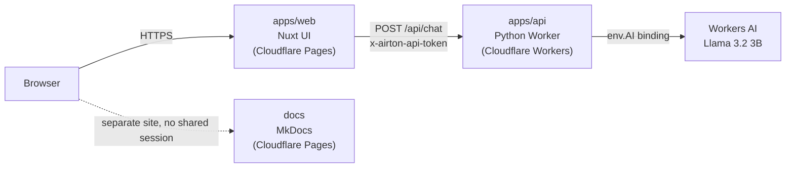
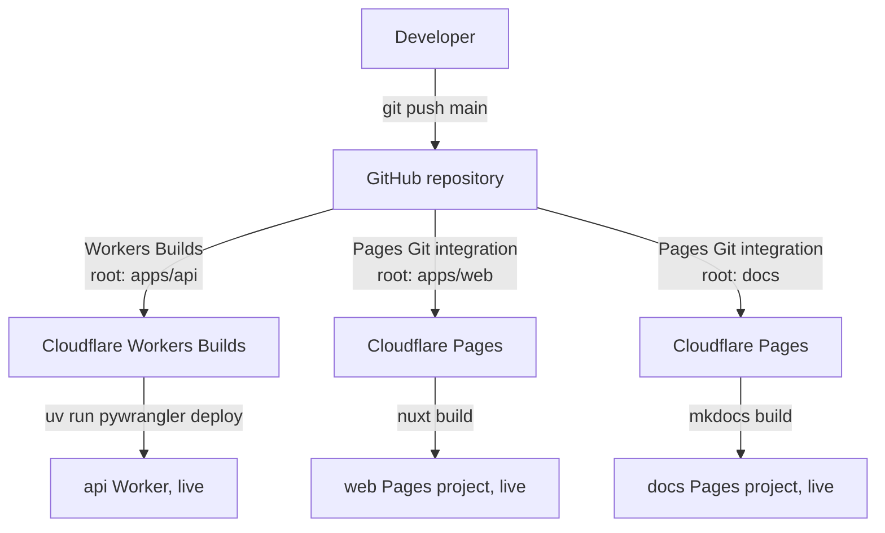

# Architecture

This page describes how Airton is put together: the three deployable pieces,
how a chat request actually flows through them, how each piece gets built
and deployed, and how secrets and domains are managed. It assumes no prior
Cloudflare knowledge — Cloudflare-specific terms are explained the first
time they come up.

## The three pieces

Airton is a monorepo with three independently deployed pieces:

| Path | What it is | Deployed as |
|---|---|---|
| `apps/web` | Nuxt UI frontend the user signs into and chats with | Cloudflare Pages |
| `apps/api` | Python backend that talks to the AI model | Cloudflare Worker |
| `docs` | This documentation site | Cloudflare Pages |

They live in one Git repository, but Cloudflare builds and deploys each one
on its own — a change to `apps/web` does not rebuild `apps/api`, and vice
versa. See [Build and deploy](#build-and-deploy) for how that works.

## Request flow

A chat message makes three hops:

1. The browser talks only to `apps/web`. It never calls the API directly.
2. `apps/web`'s own server route (`server/api/chat.post.ts`) checks the
   visitor has a valid session, then forwards the request to `apps/api`,
   adding a shared secret header (`x-airton-api-token`) so the API can tell
   the request really came from the web app and not a random caller.
3. `apps/api` validates that header, validates the message payload, then
   calls Workers AI (Cloudflare's own hosted model inference) and streams
   the model's response straight back through both hops to the browser as
   [server-sent events](https://developer.mozilla.org/en-US/docs/Web/API/Server-sent_events)
   — the text appears token by token instead of waiting for the full reply.

The docs site is unrelated to this flow. It is a separate static site with
no shared login, deployed independently.

## What a "Worker" is, versus a "Pages project"

Two different Cloudflare products are in play here, and the distinction
matters for the rest of this document:

- **A Worker** is a small program that runs on Cloudflare's network every
  time a request comes in — there is no server sitting idle between
  requests. `apps/api` is a Worker: it only exists as running code for the
  few milliseconds it takes to handle one request.
- **A Pages project** is built for hosting a website that's mostly static
  files (HTML/CSS/JS) produced by a build step, optionally with some
  server-side logic bundled in. `apps/web` and `docs` are Pages projects:
  Nuxt and MkDocs each run a build that produces a folder of files, and
  Pages serves that folder.

Under the hood Pages is itself implemented on top of Workers, but from a
"how do I deploy this" perspective they are configured in different places
in the Cloudflare dashboard and have different build settings.

## apps/web — the frontend

- **Framework**: [Nuxt 4](https://nuxt.com/) with the
  [Nuxt UI](https://ui.nuxt.com/) component library.
- **Auth**: there is no user database. `server/api/auth/login.post.ts`
  checks the submitted email/password against two accounts (`admin` and
  `client`) whose credentials come from environment variables, using a
  constant-time comparison so response timing can't leak which character
  of the password was wrong. On success it calls `setUserSession`, from the
  [`nuxt-auth-utils`](https://github.com/atinux/nuxt-auth-utils) module,
  which stores the session in an encrypted, signed cookie — sealed with the
  `NUXT_SESSION_PASSWORD` secret — so no server-side session store is
  needed.
- **Pages that require login** (like `/chat`) run through a route
  middleware (`app/middleware/authenticated.ts`) that redirects signed-out
  visitors back to `/`.
- **Talking to the API**: the browser never calls `apps/api` directly — it
  calls `apps/web`'s own `/api/chat` route, which re-checks the session,
  then proxies the request onward with the shared API token attached (see
  [Secrets](#secrets-and-configuration)).
- **Build**: Nuxt's server engine (Nitro) is configured with the
  `cloudflare-pages` preset (`nuxt.config.ts`), which outputs a `dist/`
  folder shaped the way Cloudflare Pages expects.

## apps/api — the backend

- **Runtime**: a [Python Worker](https://developers.cloudflare.com/workers/languages/python/)
  — Cloudflare Workers normally run JavaScript, but Python is supported via
  [Pyodide](https://pyodide.org/) (Python compiled to WebAssembly). Python
  dependencies are declared in `pyproject.toml` and vendored at deploy time
  by a tool called **Pywrangler**, rather than installed the normal `pip`
  way — Workers don't have a filesystem to install packages into, so
  everything needed at runtime has to be bundled in ahead of time.
- **Routes**: it only knows two routes — `GET /` (a plain health check) and
  `POST /api/chat`. Everything else, or the wrong HTTP method, gets a JSON
  error.
- **Two layers of access control** on `/api/chat`:
  1. The `Origin` header on the incoming request must match the
     `WEB_ORIGIN` environment variable, so only requests that claim to come
     from the deployed web app's own domain are entertained.
  2. The `x-airton-api-token` header must match the `API_ACCESS_TOKEN`
     secret. This is the actual gate — Origin headers can be spoofed by
     non-browser clients, so the shared-secret check is what really
     prevents random callers from using the API.
- **Input validation**: message count, message length, allowed roles
  (`user`/`assistant`), and that the conversation ends on a user message
  are all checked before anything reaches the model — bad input fails fast
  with a 400 instead of wasting an AI inference call.
- **Calling the model**: `env.AI` is a **binding** — a handle Cloudflare
  injects into the Worker at runtime that lets it call another Cloudflare
  product (here, Workers AI) directly, with no API key or network hop to
  manage. The Worker requests the `@cf/meta/llama-3.2-3b-instruct` model
  with `stream: True`, and forwards the raw response stream straight back
  to the caller.

## docs — this site

A plain [MkDocs](https://www.mkdocs.org/) site (Material theme) built from
Markdown files in `docs/`. It has no backend, no auth, and no relationship
to `apps/web` or `apps/api` beyond living in the same repository. Its
MkDocs configuration intentionally lives inside `docs/` rather than the
repo root, so the root of the monorepo isn't cluttered with docs-site
tooling.

## Build and deploy

Every push to `main` on GitHub can trigger up to three independent builds,
depending on which files changed. Cloudflare offers two different
push-to-deploy mechanisms, one per product family:

- **Workers Builds** is Cloudflare's CI/CD for Workers: you connect a
  Worker to a GitHub repo, point it at a subfolder (`apps/api`), and it
  runs a build command and a deploy command on every push. `apps/api`'s
  deploy command is `uv run pywrangler deploy` rather than the default
  `wrangler deploy`, because a plain Wrangler deploy doesn't know how to
  vendor Python dependencies — only Pywrangler does.
- **Pages Git integration** is the equivalent mechanism for Pages
  projects: connect a repo, point it at a subfolder, set a build command
  and an output directory. `apps/web` and `docs` each get their own Pages
  project this way, each watching a different subfolder of the same repo.
- Both mechanisms support **monorepos** the same way: a "root directory"
  setting tells Cloudflare which subfolder to treat as the project, so one
  GitHub repository can back three completely independent deployments.

None of this requires a GitHub Actions workflow file — the CI/CD lives in
Cloudflare's own dashboard, tied to the repo via a GitHub App Cloudflare
installs once per account.

## Secrets and configuration

Two kinds of configuration exist in Cloudflare: **variables** (plain text,
visible in the dashboard) and **secrets** (write-only — you can set them,
but never read the value back). Locally, the equivalent files are
`.env`/`.env.example` (web) and `.dev.vars`/`.dev.vars.example` (api) —
all four of the non-`.example` files are gitignored, since they hold real
credentials.

The important pairing to know about: `apps/api`'s `API_ACCESS_TOKEN`
secret and `apps/web`'s `NUXT_AIRTON_API_TOKEN` variable must hold the
**same value** in every environment — that's the shared secret described
in [apps/api](#appsapi--the-backend). If they drift out of sync, the web
app's chat requests start getting rejected with 401s.

| Variable | Where | Purpose |
|---|---|---|
| `API_ACCESS_TOKEN` | `apps/api` secret | Must match `NUXT_AIRTON_API_TOKEN` below |
| `WEB_ORIGIN` | `apps/api` variable | Expected `Origin` of legitimate requests |
| `NUXT_SESSION_PASSWORD` | `apps/web` secret | Seals the session cookie |
| `NUXT_AIRTON_API_TOKEN` | `apps/web` secret | Must match `API_ACCESS_TOKEN` above |
| `NUXT_AIRTON_API_URL` | `apps/web` variable | Where to reach `apps/api` |
| `NUXT_AIRTON_ADMIN_EMAIL` / `_PASSWORD` | `apps/web` secret | The one admin account |
| `NUXT_AIRTON_CLIENT_EMAIL` / `_PASSWORD` | `apps/web` secret | The one client account |

## Domains today, and the plan ahead

No custom domain is registered yet, so everything currently lives on
Cloudflare's free subdomains:

| Piece | Current URL |
|---|---|
| `apps/web` | `airton-48b.pages.dev` |
| `apps/api` | `airton-api.marcoalmeida-dev-br.workers.dev` |
| `docs` | not yet deployed |

Once a real domain is registered, the plan (referred to elsewhere as
**Option A**) is separate subdomains under one root domain — for example
`app.airton.com` for the frontend and `docs.airton.com` for this site,
each attached independently to its own Cloudflare project. No path-based
routing or shared-domain complexity is needed for that; it's the same kind
of one-time dashboard step as attaching any custom domain.

## Glossary

- **Worker** — a program that runs on Cloudflare's edge network only while
  handling a request; there's no always-on server underneath it.
- **Pages project** — Cloudflare's product for hosting a built website
  (static files, optionally with some server code), as opposed to a raw
  Worker.
- **Binding** — a handle Cloudflare injects into a Worker's code at
  runtime, giving it direct access to another Cloudflare product (like
  Workers AI) without an API key or network call.
- **Secret vs. variable** — both are configuration values attached to a
  Worker or Pages project; secrets are write-only (Cloudflare will never
  show you the value again after you set it), variables are plain text.
- **Workers Builds / Pages Git integration** — Cloudflare's own
  push-to-deploy systems, one per product family, both driven by
  connecting a GitHub repository through the dashboard.
