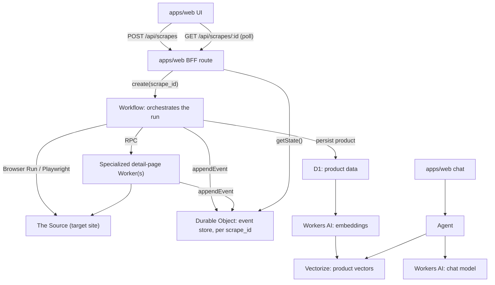

# Deep dive: Cloudflare architecture for Activity 01

This maps each phase in the [overview](index.md) to the specific
Cloudflare products it needs and why. Nothing here is committed code yet —
it's the shape we're planning to build toward, written down so we don't
have to reconstruct the reasoning when we resume.

## The core idea: event sourcing for scrape runs

Every scrape execution is identified by a `scrape_id`. Rather than storing
"the current status" as a single row that gets overwritten, we record what
happened as an append-only sequence of events —
`scrape.requested`, `page.scraped`, `scrape.completed`, `scrape.failed` —
and derive current state (status, duration, pages done) by replaying that
sequence. This is what makes "follow a scrape until completion" (phase 2–3)
possible without guessing at partial state.

## Product-by-product

### Durable Objects — the event store

One **Durable Object** instance per `scrape_id`. Each instance has its own
embedded SQLite database holding that run's events, and Durable Objects
serialize all access to a given instance — so `page.scraped` events firing
from multiple places can't race each other for the same run. This is the
foundation everything else writes into.

### Workflows — orchestrating a scrape run

A **Workflow** instance (one per `scrape_id`, same ID as the Durable
Object) drives the run: scrape the entry point, discover what needs
scraping next, retry failures per-step without re-doing already-completed
work, and — critically — survive far longer than a single Worker
invocation could. This is what lets phase 4's "enhanced scraping" grow in
scope without hitting Workers' per-invocation time limits.

### RPC service bindings — specialized scrapers

If the Source has more than one page shape (a listing/master page vs.
individual product/detail pages), each shape gets its own small Worker,
called directly from the orchestrating Workflow via a **service binding**
— a typed method call between Workers, no HTTP round-trip. All of them
write into the same Durable Object event stream by passing along the
shared `scrape_id`.

### Browser Run — actually fetching pages

Cloudflare's managed headless browser product. For phase 1's simple
scraper, plain `fetch()` may be enough if the Source doesn't need
JavaScript to render. If it does, `@cloudflare/playwright` drives a
Cloudflare-hosted browser from the scraper Worker — no browser
infrastructure for us to run ourselves.

### apps/web (BFF endpoints) — phase 2 and 3

Two server routes, following the same pattern as the existing
`/api/chat` proxy:

- `POST /api/scrapes` — starts a Workflow instance (`scrape_id` generated
  or supplied), returns immediately with the ID.
- `GET /api/scrapes/:scrape_id` — reads the Durable Object's derived
  state, for the UI to poll.

The UI (phase 3) just polls the second endpoint until status is
`completed` or `failed` — it doesn't need to know anything about
Workflows or Durable Objects underneath.

### D1 and/or R2 — product persistence (phase 4)

Structured product fields (name, price, SKU, whatever the Source exposes)
go in **D1** — queryable, relational, easy to browse. Larger raw
artifacts (full page HTML, images) if we need to keep them go in **R2**,
cheaper for bulk storage than trying to cram them into D1 rows.

### Vectorize + Workers AI — the RAG (phase 5)

Product data gets embedded (**Workers AI** embedding model) and stored in
**Vectorize**, Cloudflare's vector database. Retrieval at query time means
running the same embedding model on the question and querying Vectorize
for nearest matches — standard RAG shape, no new infrastructure beyond
what `apps/api` already uses Workers AI for.

### The Agent (phase 6–7)

Not yet decided which framework — worth evaluating Cloudflare's own
**Agents SDK** (`@cloudflare/agents`) given it already persists
per-entity state in a Durable Object, the same pattern we're using for
the event store, versus a lighter hand-rolled approach directly in
`apps/api` (already a Workers AI caller). This decision belongs in phase 6
itself, not before.

## Target shape, once all seven phases land

## Open decisions, deliberately left for when we resume

- Which Source to scrape.
- Plain `fetch()` vs. Browser Run/Playwright — depends on whether the
  Source needs JS rendering.
- Agent framework — Agents SDK vs. a lighter hand-rolled approach in
  `apps/api`.
- Whether R2 is needed at all for phase 1–4, or D1 alone is enough until
  proven otherwise.
